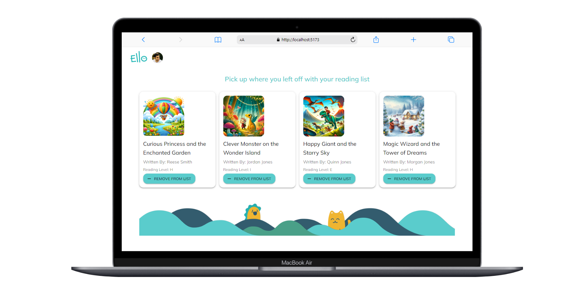

# Ello Engineering Challenge

## Getting Started
run `pnpm install` to install dependencies

run `pnpm dev` to start the development server

create a `.env` file in the root of the frontend project with the following content:
VITE_SERVER_URL= your server url

## Project tech stack
- Vite
- React (for frontend)
- Typescript (for type safety)
- GraphQL (api)
- Apollo Client (for GraphQL api calls)
- Material UI (for styling)
- TanStack Router (for routing)

## Project screenshot
mobile screen

desktop screen

search feature

reading list page (no books added yet)

reading list page (books added)

